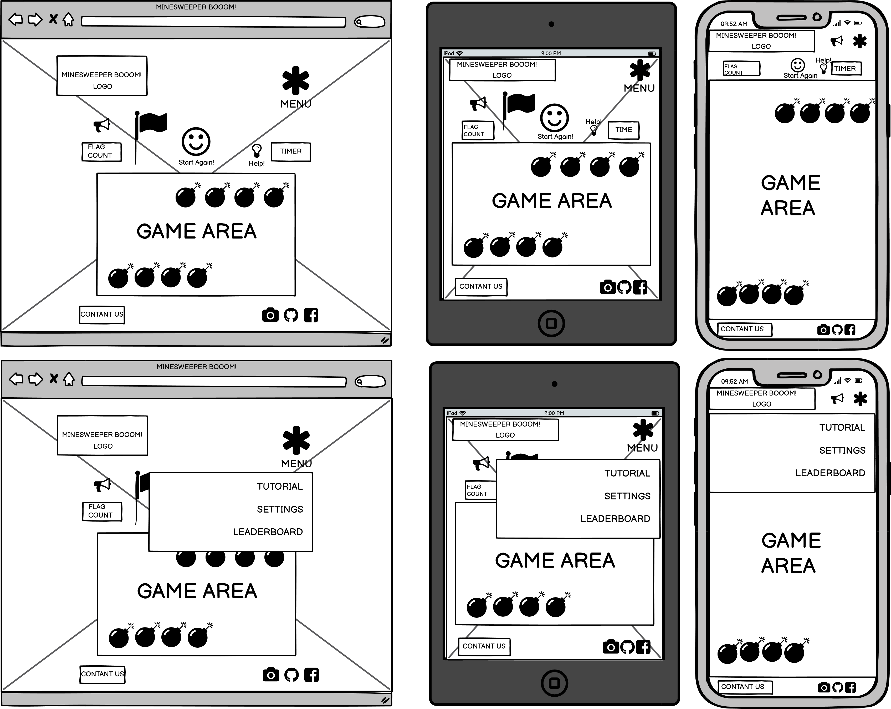

# Minesweeper BOOOM!
## By Marja Marinić
### Code Institute - Milestone Project 2
Minesweeper BOOOM! website focuses on recreating classic Minesweeper game with modern twist!
Minesweeper - a game that consists of "mine sweeping" - is one of early games introduced to Windows, and, in fact was part of the standard Windows 3.1 edition. 
Search for mines using neighbouring fields as indicators where the mines are, find them all and win the game!

# Table of content: 

    
Expand!

1. [User Experience (UX)](#user-experience-UX)
    - [Strategy](#strategy)
    - [User Stories](#user-stories)
    - [Scope](#scope)
    - [Structure](#structure)
    - [Skeleton](#skeleton)
2. [Design](#design)
    - [Imagery](#imagery)
    - [Color Scheme](#color-scheme)
    - [Typography](#typography)
    - [Icons](#icons)
    - [Styling](#styling)
3. [Features](#features)
    - [Features Implemented](#features-implemented)
    - [Features Left to Implement](#features-left-to-implement)
4. [Technologies](#technologies)
5. [Testing](#testing)
    - [Tests](#tests)
    - [Bugs](#bugs)
6. [Deployment](#deployment)
7. [Credits](#credits)

# User Experience (UX)

## Strategy
Provide online application so the user can play their favorite game!
Minesweeper BOOOM! application follows the principal "simplicity is the key" and thus provide it's users with intuitive navigation methods, both throughout the website and gameplay.
## User Stories
- ### New Player
    - I want an app that is responsive, so I can play the game on various devices.
    - I want an app that is uploading quickly, so I won't get annoyed.
    - I want to go through tutorial so I can learn how to play the game.
    - I want to adjust the game settings according to my preferences.
    - I want to be able to mute the game, but to have the sound option as well.
    - I want to be able to restart the game whenever I want to.
    - I want to be able to see end result of my finished game.
    - I want to be able to get in touch with creators of the game, in case I have any queries.
- ### Player in the Game
    - I want to see how many flags I have left, so I know how many more mines are left.
    - I want to see the timer, so I know how would that reflect on my score.
    - I want to be able to click on a field.
    - I want to be able to cancel my click on a field.
    - I want to be able to place the flag.
    - I want to see result of clicking/placing flag on the field.
    - I want to see mines that I didn't succeed to find when losing the game.
    - I want to see the score that I earned, either from a win or a lose.
- ### Returning Player
    - I want to see my ranking/statistics, so that I can see my progress.
    - I want to select different difficulty level, so I can test my abilities.
    - I want to select custom game, so I can play for fun, without the scoring pressure.
    - I want to be able to follow the game on social media so I can immerse myself with Minesweeper community.

## Scope

## Structure

## Skeleton
- ### [Landing Page](assets/doc/wireframes/landing-page.png)
    
- ### Wireframes
    - [Tutorial](assets/doc/wireframes/tutorial.png)
    - [Settings](assets/doc/wireframes/settings.png)
    - [Leaderboard](assets/doc/wireframes/leaderboard.png)
    - [Get in Touch](assets/doc/wireframes/get-in-touch.png)
    - [Win](assets/doc/wireframes/win.png)
    - [Lose](assets/doc/wireframes/lose.png)
# Design

## Imagery

## Color Scheme

## Typography

## Icons

## Styling

# Features
Please note, some of the features are still in progress, due to creator's slow progress. Creator is new to coding.

## Features Implemented
- ### Minesweeper game
    Functional Minesweeper game is made.
    - Reveal field
    Reveal field using right click.
    - Flag field
    Flag field using right or left click, depending on user preferences.
- ### Minesweeper controls
    Minesweeper controls is a bundle of functionalities that user can manipulate, and which are, of utmost importance for smooth gameplay. 
    - Start New Game
    Gives user an option to restart the game, or just reset the gaming board.
    - Timer
    User can track time, and thus see how long is their gameplay.
    - Flag Counter
    User can track how many bombs they have to find, or see if they flagged wrong fields.
    - Flag Click Remapper
    Useful for mobile device, represents right click, and switches from state to state dynamically.
- ### Settings
    User can choose between 3 different difficulty levels, for larger screen devices those levels provide different Minesweeper board sizes.
- ### Social links
    User can follow creator on number of different social networks.
- ### Win/Lose outcome
    Depending on the user ability to solve the game, they will be awarded with Win or Lose status.

## Features Left to Implement
- ### Connect
    Connect feature is still in progress, there are stylings that needs to be added, as well as connecting the form to emailjs.
- ### Leaderboard 
    Leaderboard is still in progress, there are stylings that needs to be added, as well as fixing modal function.
- ### Tutiral
    Tutorial feature should help New Players with general knowledge about how to play the game. It should be implemented.
- ### Audio
    Audio is feature that can elevate game experience. It should be implemented.
# Technologies

# Testing

## Tests

## Bugs

# Deployment

# Credits